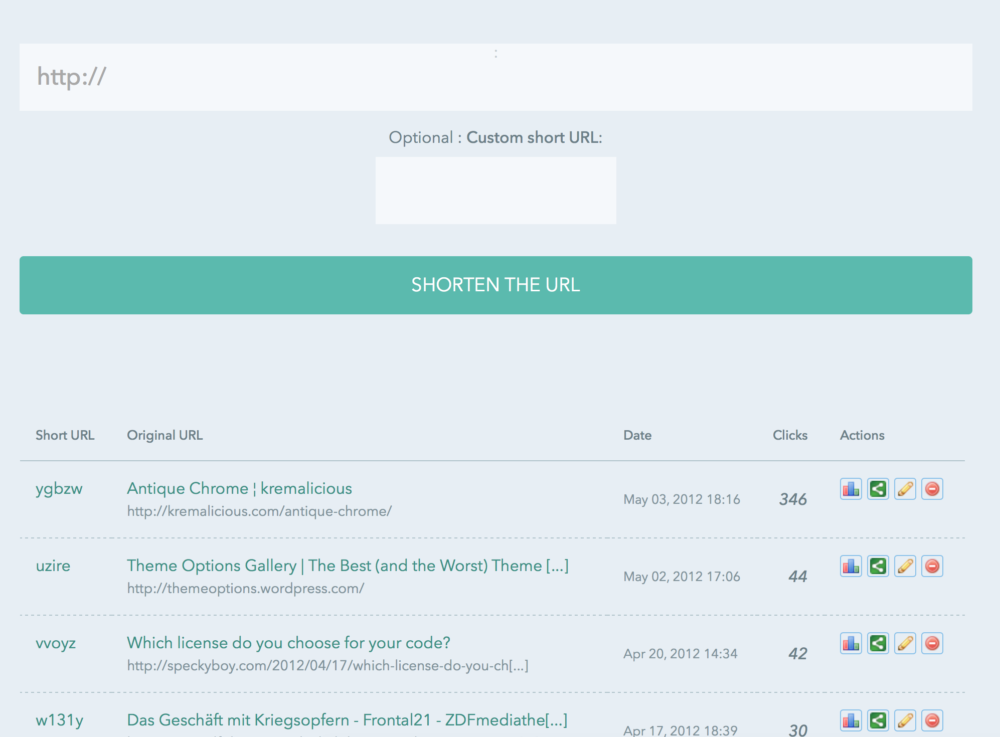
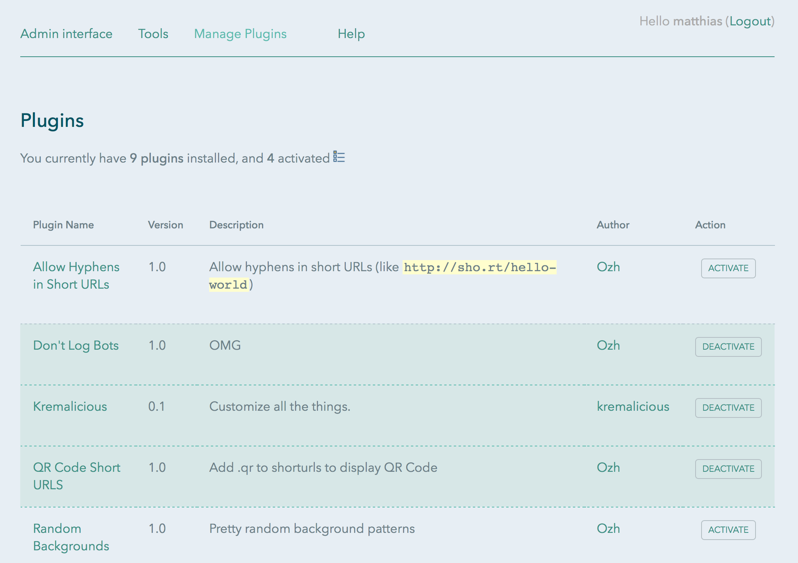

# krt.mn

> My own url shortener based on [YOURLS - Your Own URL Shortener](http://yourls.org/) ([GitHub](https://github.com/YOURLS/YOURLS))

It has a public front page under https://krt.mn with the latest shortened url. The backend is a completely restyled interface based on the YOURLS default styles (which are quite ugly). Here's what it looks like in the admin area:

Everything custom is happening in `/user`:

- `user/plugins/kremalicious/plugin.php` adds css file link and a bit more dynamically to the html `head`
- `user/css/krtmn.css` overwrites the default styles

## License & Usage

As the original YOURLS you're free to do whatever you want with this. But using this without further modifications as your own url shortener is probably not a good idea.

## Acknowledgements

Many thanks to:

- Ozh Richard ([@ozh](https://twitter.com/ozh)) for creating yourls
